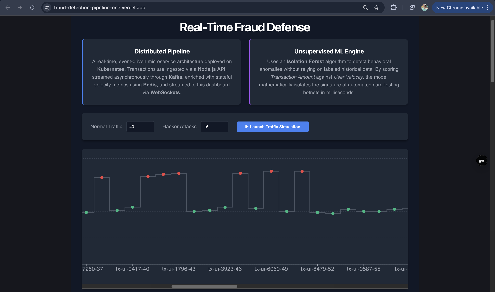

# Real-Time Event-Driven Fraud Detection Pipeline

 
*(Note: Replace the image path with your actual screenshot file once uploaded to the repo)*

**Live Demo:** [[https://fraud-detection-pipeline-one.vercel.app](https://fraud-detection-pipeline-one.vercel.app)](https://fraud-detection-pipeline-one.vercel.app/)

## Inspiration

During my time engineering trade confirmation solutions at Synechron and leading security delivery at Accenture, I saw firsthand the critical need for absolute precision and ultra-low latency in financial technology. Security systems can't afford to be reactive. 

Now, as I complete my MS in Computer Science at UNC Charlotte, I wanted to bridge my enterprise fintech background with the distributed systems and machine learning concepts I’ve been exploring. I built this project to prove that enterprise-grade, event-driven architectures can be built cleanly, deployed entirely serverless, and respond to anomalies in milliseconds.

## The Business Problem

In the financial sector, "card-testing" botnets bombard payment gateways with thousands of small transactions to see which stolen credit card numbers are valid. 
Traditional batch-processing fraud engines pull data from a database every few minutes or hours. By the time a batch job detects the botnet's velocity, the hackers have already validated the cards and moved on to massive purchases. Fraud detection must happen in real-time, in-flight, before the transaction is permanently committed.

## The Solution & Logic

I architected a decoupled, event-driven microservices pipeline that scores transactions as they stream. 

Instead of relying on historical labeled data (which struggles against zero-day attack patterns), the engine uses an **Isolation Forest** (an Unsupervised Machine Learning algorithm). As traffic streams in, a fast, stateful Redis cache tracks the *User Velocity* (transactions per minute). The ML model mathematically isolates anomalies by scoring the *Transaction Amount* against this real-time velocity, catching automated botnets the second their behavior deviates from human norms.

## Tech Stack

*   **Frontend:** React.js, Vite, Tailwind CSS
*   **Backend APIs:** Node.js, Express.js
*   **Machine Learning Engine:** Python, Scikit-Learn, Pandas
*   **Message Broker:** Apache Kafka (hosted on Aiven)
*   **Stateful Cache:** Redis (Serverless via Upstash)
*   **Communication:** WebSockets (Socket.io)
*   **Cloud/Deployment:** Vercel (Frontend), Render (Backend Microservices)

## Architecture & Data Flow

The system is split into three decoupled microservices communicating through Kafka:

1.  **Traffic Generator (React):** The user launches a simulated mix of normal human traffic and rapid hacker attacks. The React app sends HTTP `POST` requests to the Ingestion API.
2.  **Ingestion Service (Node.js):** Acts as the gateway. It receives the HTTP payload and immediately publishes the raw transaction to the `raw-transactions` Kafka topic, then returns a 200 OK to the frontend (ensuring zero blocking).
3.  **Inference Engine (Python):** A headless worker continuously consuming the `raw-transactions` topic. It reads the user's recent activity from Redis, runs the Isolation Forest prediction, and publishes the scored result (Fraud Probability %) to the `fraud-alerts` Kafka topic.
4.  **WebSocket Bridge (Node.js):** Consumes the `fraud-alerts` topic and instantly broadcasts the scored transaction back to the React frontend via WebSockets, rendering it on the live chart.

## Challenges Faced

### During Implementation
*   **State Management in a Stateless Container:** Machine learning models often need historical context to make predictions. I had to ensure the Python container remained completely stateless so it could be scaled horizontally. I solved this by offloading the state (user velocity) to an ultra-fast Redis cache.
*   **Asynchronous Chaining:** Coordinating the exact timing between an HTTP POST firing, a Kafka message passing through two different topics, and a WebSocket returning the data to the exact right place on the frontend UI without race conditions required strict event payload tracking.

### During Deployment
Moving from my local Kubernetes setup to Serverless PaaS introduced several SRE hurdles:
*   **Cross-Origin Resource Sharing (CORS):** Decoupling the frontend (Vercel) from the backend (Render) caused strict browser CORS blocking. I had to explicitly configure CORS headers on both the Express HTTP routes and the Socket.io WebSocket handshake.
*   **PaaS Health Checks on Headless Workers:** Render automatically kills Web Services that don't bind to an HTTP port within a timeout window. Because my Python ML engine only communicated with Kafka and didn't accept HTTP requests, I had to implement a lightweight, multi-threaded "dummy" HTTP server strictly to satisfy Render's port-scanning health checks.
*   **Kafka Authentication:** Migrating to Aiven Kafka required debugging SASL PLAIN authentication via KafkaJS, ensuring exact credential mapping and secure injection of environment variables to prevent accidental credential leakage on GitHub.

## Future Scope

*   **Observability:** Drawing from my previous local SRE Reliability Lab projects, I plan to instrument the Node.js and Python services with Prometheus metrics and visualize the Kafka consumer lag in a Grafana dashboard.
*   **Multi-Partition Scaling:** Currently, the Kafka topics use a single partition. I plan to introduce partition keys based on `userId` to guarantee message ordering while allowing multiple Python inference containers to process the stream in parallel.
*   **CI/CD Pipeline:** Implement GitHub Actions to automatically run unit tests and trigger Render/Vercel deployments on code merges.
